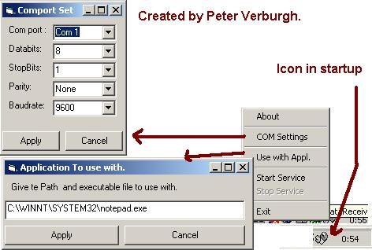



## RS232\-Datalook Updated V1\.1

### Description

NOW UPDATED!!!

With errorhandling and detecting if the application you want to send the recieved data to is active ! (looks after the right process!)

With this application , you can receive data from a serial device & let it send the to a appliction, example , port COM1 & appl is Excell... so the data sendit to com1 would be displayed in excell.

Look at my other Code on PSC

15-07-2001 TCP-IP datalook (spy data between client & server applications)

Vote for me ,

Greetings,

Peter Verburgh.
 
### More Info
 
use MSCOMM control (standard in VB)

             |
---                |---
**Submitted On**   |2001-07-17 03:31:54
**By**             |[Peter V\.](https://github.com/Planet-Source-Code/PSCIndex/blob/master/ByAuthor/peter-v.md)
**Level**          |Beginner
**User Rating**    |4.7 (109 globes from 23 users)
**Compatibility**  |VB 4\.0 \(32\-bit\), VB 5\.0, VB 6\.0
**Category**       |[Complete Applications](https://github.com/Planet-Source-Code/PSCIndex/blob/master/ByCategory/complete-applications__1-27.md)
**World**          |[Visual Basic](https://github.com/Planet-Source-Code/PSCIndex/blob/master/ByWorld/visual-basic.md)
**Archive File**   |[RS232\-Data229167162001\.zip](https://github.com/Planet-Source-Code/peter-v-rs232-datalook-updated-v1-1__1-25107/archive/master.zip)

